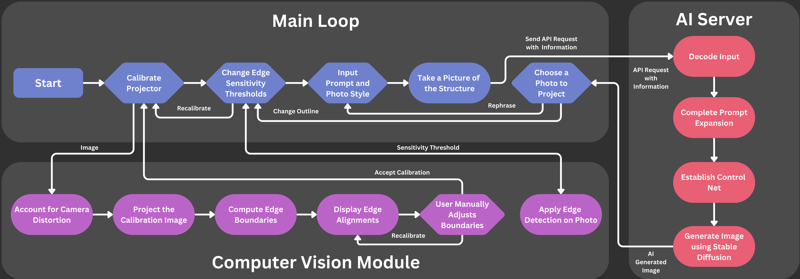

# Application Documentation
## Software Block Diagram

* Application is made up of "Main Loop" and the "Computer Vision" Module
## File structure
```
├── /application           # Qt/Computer Vision application for Raspberry Pi
│   ├── /resources              # Images, icons, etc.
│   ├── /src                    # Source code
│   |   ├── / pages                 # Application pages
│   |   |   ├── / calibration                 # Calibration page
│   |   |   ├── / create                      # Home page
│   |   |   ├── / pickImages                  # PickImages page
│   |   |   ├── / project                     # Preview page
│   |   |   ├── / sensitivity                 # Sensitivity page
│   |   |   ├── / sidebarPages                # *Not-Active Pages, for future use (WIP)
|   |   |   ├── / textVision                  # Write Prompt for Generative AI
│   |   ├── / utils             # Utility functions
│   |   ├── / windows           # Main window and Projection window
│   |   ├── / main.cpp          # Main application file
│   └── CMakeLists.txt          # CMake build system file
```

## Application Pages
### Create Page (Home Page)
#### Overview:
- Provides initial instructions and allows the user to make sure the webcam and projector are working correctly.

### Calibration Page


#### Overview:
Calibration ensures your projected images align perfectly with the physical surface. By selecting the four corner points of the projection area, you effectively "wrap" a virtual canvas around the real-world surface.

#### Key Features:
- **Real-Time Camera Feed:**
  Utilizes **OpenCV** to display a live video feed of your projection area, enabling immediate, responsive adjustments.

- **Interactive Corner Selection:**
  Allows users to click on the camera feed to pinpoint the exact corners of the surface.

- **Precision Tools:**
  Includes a built-in **magnifying glass** feature for meticulous corner alignment and dynamic **Region of Interest** visualization powered by **Canny Edge Detection**, ensuring every detail is captured accurately.

- **Illumination Assistance:**
  Projects a white screen onto the target surface, illuminating subtle features and textures to guide precise corner placement.

- **Final Alignment Refinement:**
  Once the four corners are chosen, a still image is captured. **Canny Edge Detection** then aids in further refining the alignment, ensuring the "virtual canvas" seamlessly matches the actual projection area.

#### Result:
After this process, your system’s output will be perfectly tailored to the chosen surface, enabling crisp, distortion-free projections that align with the intended physical space.

### Sensitivity Page


#### Overview:
The Sensitivity Page allows you to fine-tune the outline detection parameters used in your projection setup. By adjusting upper and lower thresholds, you directly influence how edges and contours are recognized. This calibration is essential to guiding downstream generative AI processes in accurately interpreting the visual scene and producing refined outputs.

#### Key Features:
- **Real-Time Visualization:**
  The interface continuously displays the current feed or captured image, providing immediate feedback as you adjust the sensitivity sliders.

- **Adjustable Sensitivity Sliders:**
  Two horizontal sliders let you refine upper and lower sensitivity values, ensuring the resulting edges are tuned to your unique environment. This fine-grained control ensures that what the AI "sees" aligns closely with what you intend it to interpret.

- **User-Friendly Interface:**
  Enjoy a streamlined UI with a prominent title, intuitive sliders, and clearly labeled buttons— all styled consistently for a visually appealing and efficient user experience.

- **Impact on Generative AI Recognition:**
  By optimizing these sensitivity values, you guide the generative AI to accurately distinguish edges and contours within the projected scene. The output from this step will serve as a more reliable input for later AI-driven image generation, refining the quality of the system’s final visual results.

- **Instant Feedback and Confirmation:**
  Adjust the sliders and instantly see the changes reflected in the displayed image. Once satisfied, click **"THIS LOOKS GOOD!"** to confirm or select **"LET'S TRY AGAIN"** to revert and tweak the settings further.

#### Result:
After careful sensitivity tuning, subsequent AI-based image generation will be grounded on a more accurate representation of edges and outlines. This ensures higher-fidelity projections that align perfectly with both the physical environment and the creative goals of your application.

### Text Vision Page (Vision Description Page)
#### Overview:
This page lets you type a short prompt describing your intended scene. You can choose between **Realistic** or **Animated** styles, then submit your prompt to guide the generative AI in creating your desired images.

#### Steps:
- **Select a Style:** Toggle between Realistic and Animated to influence the final image’s look.
- **Enter Your Prompt:** Type a short description (1–2 sentences).
- **Submit to Proceed:** Click **+ SUBMIT** once you’ve provided enough detail. On devices like Raspberry Pi, a virtual keyboard may appear to assist with input.

#### Result:
When you finalize your prompt, the system will package your input (style and prompt) and send it to the generative AI server. The AI will then process your request and generate a custom image based on your description.

### Pick Images Page


#### Overview:
This page displays the generative AI’s output based on your prompt. You can view and select from a series of generated images, choosing the one that best fits your vision.

#### Steps:
- **Select an Image:** View the generated images and choose the one you like best.
- **Adjust Prompt**: If the images don't match your vision, you can go back to the Vision Description page and adjust your prompt.
- **Adjust Image:** If the calibration or sensitivity isn't quite right, you can go back to the calibration page.
- **Confirm Selection:** Once you've chosen an image, click **"CHOOSE PICTURE"** to proceed to the final projection.

### Project Page
#### Overview:
The Project Page displays the final image you’ve selected, projected onto the calibrated surface.

