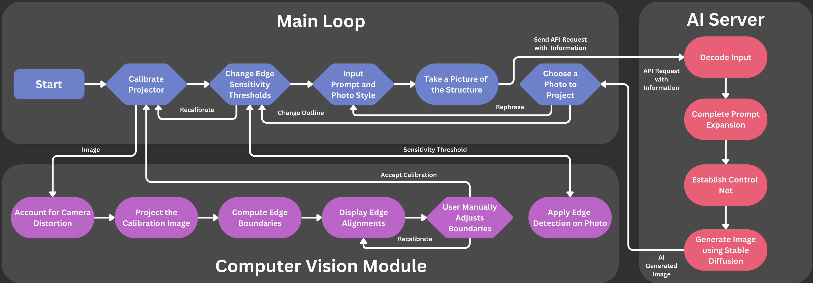

# GPMS: A Generative Projection Mapping System
## What is GPMS?


The **Generative Projection Mapping System (GPMS)** brings professional projection mapping technology to everyday users, offering immersive visual storytelling for *hobbyists* and *entertainers*. While current projection mapping systems are expensive and complex, GPMS makes it accessible and easy to use.

GPMS uses **generative AI** and **computer vision** to transform any surface into a visual canvas. It scans the surface’s structure, generates custom images based on user input, and projects them in alignment with the surface’s features. The system combines a projector, touchscreen interface, and advanced image processing to ensure seamless and dynamic visual integration.

Designed for personal or small-scale use, GPMS appeals to independent artists, event organizers, businesses, and families looking for creative, engaging experiences. Its portable, user-friendly setup removes the technical barriers of traditional systems, offering a customizable and cost-effective solution.

Unlike existing high-end solutions, GPMS offers **simplicity** and **flexibility** without sacrificing quality. Potential applications include entertainment at events, educational tools, interactive art installations, immersive branding for businesses, and home use. With its innovation, ease of use, and accessibility, **GPMS empowers users to bring professional-level projection mapping to their own spaces**.

### Demo Videos
See the [GPMS Showcase Video](https://youtu.be/qrpPFPNZv5Y?si=yPMPCoVFA5JilcbL) below for a brief overview as well as a demonstration of the system!
[](https://youtu.be/qrpPFPNZv5Y?si=j_Yjs6wRfdOsnGKn)

For a complete overview of the project, see the [GPMS Project Final Presentation](https://youtu.be/wWSvm45ag2E?si=Cs-MwxPd8sfXc_ke) below!
[](https://www.youtube.com/watch?v=wWSvm45ag2E)

### Features
- **Generative AI w/ Control Nets:** Utilizes generative AI with ControlNets to create custom images based on user input and real world structures or drawings.
- **Computer Vision:** Scans the surface’s structure and aligns projected images with its features.
- **Touchscreen Interface:** Offers an intuitive interface for easy interaction and control.

## Example Use Cases
### Education
Create engaging educational tools for classrooms and interactive learning.

- **Interactive Art:**
    - **Want to show kids the power of AI?** Help kids experience collaboration with AI like never before with GPMS! Simply set up the device facing a whiteboard, draw characters, shapes, or anything you imagine, and watch as the AI transforms your sketches into vivid, lifelike creations in real time.

### Events
Enhance event experiences with dynamic visuals and interactive displays.

- **Home:** Transform living spaces with personalized visual storytelling.
    - **Have a holiday party coming up?** Use GPMS to project snowflakes, Santa, and other festive images around your home right on top of existing decor.
    - **Hosting a movie night?** Project movie posters, popcorn, and other film-related images to set the mood.
- **Business:** Create immersive branding experiences for businesses and organizations.
    - **Running an entertainment venue?** Elevate your space with AI-generated visuals that adapt in real time to the event theme. Imagine your everyday decor being used to shape the theme of your part or interactive zones where attendees can draw on a board and see their ideas instantly amplified into stunning projections across the room.
    - **Hosting a product launch?** Use GPMS to transform static logos and product images into rich, animated visuals that captivate attendees and leave a lasting impression.

## Technical Overview
### Hardware Components
GPMS consists of the following generic components that can be purchased off the shelf for DIY assembly:
- **Projector:** Displays generated images on the surface.
    - [1080P Projector](https://a.co/d/aNmRhS0)
- **Touchscreen Display:** Allows users to interact with the system.
    - [Raspberry Pi Screen 10.1 Inch Touchscreen Monitor 1024x600](https://a.co/d/dlU7RHk)
- **Webcam:** Captures images of the surface for computer vision processing.
    - [OV5647 Mini Camera Module](https://a.co/d/2ch05GE)
- **Raspberry Pi 5:** Runs the GPMS application software and connects to the projector, touchscreen interface, and camera.
    - [Raspberry Pi 5 Website](https://www.raspberrypi.com/products/raspberry-pi-5/)
- **Generative AI Server:** Server HW with a GPU capable of running the Generative AI Server.
    - In our case featuring an *AMD Ryzen 9 7950X* and an *AMD Radeon RX 7900*

#### Hardware Block Diagram


### Software Components
GPMS software includes the following components:
- **Application:** C++ Qt/Computer Vision application for Raspberry Pi.
    - Full Break down in [Application Documentation](./ApplicationDocs.md)
- **Generative AI Server**: Python API Webserver, utilizing Generative AI with ControlNets to create custom images based on user input and real world structures or drawings.
    - Full Break down in [Generative AI Server Documentation](./API-ServerDocs.md)

#### Software Block Diagram


## Quick Start Guide
### Software Setup
1. **Install the Application:** Install the GPMS application on the Raspberry Pi by pulling and building the source code from [the repository](https://github.com/thedeclancarter/GPMS).
    - Install the required dependencies:
        - `Qt Version 5.15.2`
        - `OpenCV 4.10.X`
        - `CMake 3.21.X`
        - Build the application using the provided `CMakeLists.txt` file.
    - *Note: The application is built to run on a Raspberry Pi 5 and was developed on Mac. Window's support and development are ongoing.*
    - Create the `.env` file in the root with the following information:
    ```
    export API_KEY="XXXXXXXXXXXXXXXXXXXXXXXX"
    export API_HOST="XX.XX.XX.XXX"
    export API_PORT="XXXXX"
    export API_ENDPOINT="generate"
    ```
2. **Install the Generative AI Server:** Install the Generative AI Server on the server hardware.
    - Install the required dependencies from the `requirements.txt` file.
    - Create the same `.env` file in the root with the following information:
    ```
    export API_KEY="XXXXXXXXXXXXXXXXXXXXXXXX"
    export API_HOST="XX.XX.XX.XXX"
    export API_PORT="XXXXX"
    export API_ENDPOINT="generate"
    ```
    - Start the server using the `app.py` file.
3. **Connect the Raspberry Pi to the Generative AI Server:** Ensure the Raspberry Pi is connected to the Generative AI Server via the network.
4. **Run the Application:** Run the GPMS application on the Raspberry Pi to start the system.

### Hardware Setup
1. **Connect the Projector:** Connect the projector to the Raspberry Pi using an HDMI cable.
2. **Connect the Touchscreen Interface:** Connect the touchscreen interface to the Raspberry Pi using a USB cable for power and data and an HDMI for the display.
3. **Connect the Webcam:** Connect the webcam to the Raspberry Pi using the SCI interface.
4. **Power On the Raspberry Pi:** Connect the Raspberry Pi to a power source to turn it on.
5. **Power On the Projector:** Turn on the projector to display the GPMS interface.